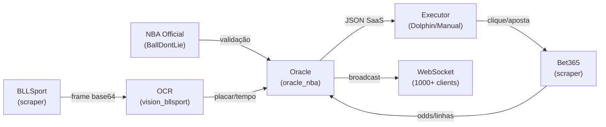

# 🏗️ Arquitetura do Projeto - Oracle NBA SaaS

## 📁 Estrutura Final (Limpa e Organizada)

```
IA-Basket/
├── 📁 backend/                     🔴 CORAÇÃO: API FastAPI
│   ├── main.py                     ⚙️ Entrypoint (uvicorn)
│   ├── oracle_api.py               🧠 40+ endpoints + WebSocket
│   ├── gemini_knowledge.py         🤖 Gemini enrichment
│   └── __init__.py
│
├── 📁 core/                        🔧 LÓGICA PURA
│   ├── oracle_nba.py              📊 Detector erros (6-level hierarchy)
│   ├── vision_bllsport.py         👁️ OCR placar/tempo
│   ├── nba_official.py            ✅ BallDontLie validation
│   └── __init__.py
│
├── 📁 integrations/                🔗 CONECTORES EXTERNOS
│   ├── 📁 scrapers/               🕷️ Extrai dados (BLLSport, Bet365)
│   │   ├── bllsport_scraper.py    📱 BLLSport live feed
│   │   ├── bet365_scraper.py      💰 Bet365 odds/lines
│   │   ├── flashscore_scraper.py  🌐 Flashscore fallback
│   │   └── __init__.py
│   │
│   ├── 📁 apis/                   🌐 Consome APIs externas
│   │   ├── balldontlie.py         🏀 BallDontLie official
│   │   ├── gemini.py              🤖 Google Gemini
│   │   ├── youtube.py             📺 YouTube live (future)
│   │   └── __init__.py
│   │
│   ├── 📁 executors/              ⚡ Executa ações
│   │   ├── dolphin_macro.py       🐬 Dolphin bot clicker
│   │   ├── manual_executor.py     👤 Manual betting UI
│   │   └── __init__.py
│   │
│   └── __init__.py
│
├── 📁 prompts/                     📝 CONTEXTOS IA
│   └── ORACLE_PROMPT_PRINCIPAL.txt
│
├── 📁 data/                        💾 DADOS (opcional)
│   ├── analytics.db               📊 Historicos
│   └── latest_oracle.json         🔄 Última análise
│
├── 📁 tests/                       ✅ TESTES
│   ├── test_oracle_api.py         API tests
│   ├── test_vision.py             OCR tests
│   ├── test_scrapers.py           Scraper tests
│   └── __init__.py
│
├── .env                           🔐 Variáveis (ignore no git)
├── .env.example                   📋 Template
├── requirements.txt               📦 Deps
├── README.md                      📖 Docs principal
├── BACKEND_STATUS.md              ✅ Status/checklist
├── ARCHITECTURE.md\*              🏗️ Este arquivo
├── run_server.ps1                 🚀 Atalho (PowerShell)
├── run_server.bat                 🚀 Atalho (CMD)
├── .git/                          📚 Versionamento
├── .venv/                         🐍 Virtual env
└── __pycache__/
```

---

## 🎯 Onde Colocar Cada Coisa

### 1️⃣ **API/Scraper de BLLSport**
📍 **`integrations/scrapers/bllsport_scraper.py`**

```python
# Exemplo: Extrair frame + placar em tempo real
class BLLSportScraper:
    """Captura live stream de BLLSport."""
    
    async def get_live_frame(self):
        """Retorna: base64 do frame atual."""
        pass
    
    async def get_placar(self):
        """Retorna: {"home": 93, "away": 85, "tempo": "Q1 05:03"}."""
        pass
```

**Depois chamar em:** `/backend/oracle_api.py` → `POST /api/oracle/ingest`

---

### 2️⃣ **Scraper de Bet365**
📍 **`integrations/scrapers/bet365_scraper.py`**

```python
# Exemplo: Extrair linhas + odds da Bet365
class Bet365Scraper:
    """Captura odds/lines de Bet365."""
    
    async def get_game_odds(self, game_id):
        """Retorna: {"Q05:03": {"line": 2.5pts, "odds": 1.40}, ...}."""
        pass
    
    async def get_placar_geral(self):
        """Retorna: {"home": 91, "away": 85}."""
        pass
```

**Depois chamar em:** `/backend/oracle_api.py` → `POST /api/oracle/ingest`

---

### 3️⃣ **API Balldontlie (Oficial NBA)**
📍 **`integrations/apis/balldontlie.py`** ← JÁ EXISTE

```python
# Validação oficial (backup/fallback)
async def fetch_balldontlie_game(game_id):
    """Retorna: placar/tempo OFICIAL da NBA."""
    pass
```

**Chamada:** `GET /api/oracle/nba/balldontlie/game?game_id=123`

---

### 4️⃣ **API YouTube (Fallback)**
📍 **`integrations/apis/youtube.py`** (FUTURE)

```python
# Se BLLSport cair, capturar de YouTube livestream da NBA
class YouTubeExtractor:
    """Captura frame de YouTube livestream."""
    pass
```

**Chamada:** `GET /api/oracle/nba/youtube/frame?channel_id=...`

---

### 5️⃣ **Executor Dolphin (Macro Clicker)**
📍 **`integrations/executors/dolphin_macro.py`** (FUTURE)

```python
# Executa clique/automação via Dolphin bot
class DolphinExecutor:
    """Executa macro de cliques (respeitando ToS)."""
    
    async def click_lugar_aposta(self, coords):
        """Clica na aposta recomendada."""
        pass
    
    async def confirmar_aposta(self, valor):
        """Confirma a aposta."""
        pass
```

**Chamada:** `POST /api/oracle/execute/dolphin` (com aprovação manual)

---

### 6️⃣ **Executor Manual (UI)**
📍 **`integrations/executors/manual_executor.py`** (FUTURE)

```python
# Dashboard simples pra usuário clicar
class ManualExecutor:
    """Mostra recomendação e permite clique manual."""
    pass
```

---

## 🔄 Pipeline Completo



---

## 📝 Checklist Setup

- [ ] **BLLSport scraper** → `integrations/scrapers/bllsport_scraper.py`
- [ ] **Bet365 scraper** → `integrations/scrapers/bet365_scraper.py`
- [ ] **BallDontLie API** → `integrations/apis/balldontlie.py` (JÁ TEM)
- [ ] **YouTube API** → `integrations/apis/youtube.py` (future)
- [ ] **Dolphin executor** → `integrations/executors/dolphin_macro.py` (future)
- [ ] **Manual executor** → `integrations/executors/manual_executor.py` (future)
- [ ] **Tests** → `tests/test_*.py`

---

## 🚀 Imports (Exemplo)

```python
# Em backend/oracle_api.py:
from integrations.scrapers.bllsport_scraper import BLLSportScraper
from integrations.scrapers.bet365_scraper import Bet365Scraper
from integrations.apis.balldontlie import fetch_balldontlie_game

# Em main.py ou startup:
bllsport = BLLSportScraper()
bet365 = Bet365Scraper()
```

---

## 🔐 .env Variables

```bash
# Scrapers (se forem APIs)
BLLSPORT_API_KEY=...
BET365_API_KEY=...

# APIs
BALLDONTLIE_API_KEY=...
GEMINI_API_KEY=...
YOUTUBE_API_KEY=...

# Executors
DOLPHIN_EXECUTABLE_PATH=C:\path\to\dolphin.exe
DOLPHIN_SCRIPT_PATH=C:\path\to\scripts\
```

---

## 📦 Requirements.txt (atualizado)

```
# Core
fastapi
uvicorn
websockets
python-dotenv

# Vision
pillow
pytesseract
opencv-python
numpy

# APIs
httpx
requests
google-generativeai

# Web scraping (optional)
playwright
selenium
beautifulsoup4

# Database (optional)
sqlalchemy

# Testing
pytest
pytest-asyncio
```

---

## 💡 Exemplo: Rodar Completo

1. **Terminal 1 - Server:**
```bash
python -m uvicorn backend.main:app --host 127.0.0.1 --port 8000 --reload
```

2. **Terminal 2 - BLLSport Scraper (loop):**
```bash
python -m integrations.scrapers.bllsport_scraper
```

3. **Terminal 3 - Bet365 Scraper (loop):**
```bash
python -m integrations.scrapers.bet365_scraper
```

4. **WebSocket Client (qualquer lugar):**
```python
import websockets
import json

async def listen():
    async with websockets.connect("ws://127.0.0.1:8000/ws/oracle") as ws:
        async for msg in ws:
            data = json.loads(msg)
            print(f"🚨 {data['diagnostico_saas']['tipo']}")
```

---

**Status: 🟢 PRONTO PARA INTEGRAR APIs**
